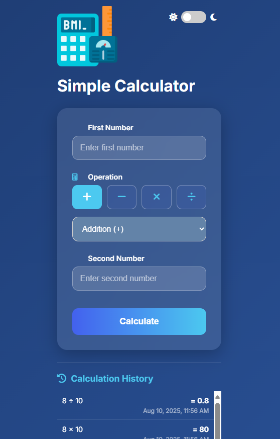

# Simple Calculator Application



A full-stack calculator application with a **React** frontend, **Flask** backend, **MySQL** database, and **Nginx** reverse proxy. Designed for easy local development (no Docker/Kubernetes required in this README). It supports basic arithmetic operations, persistent history, dark/light theme, and is easy to run locally behind an Nginx proxy.

---

## Table of Contents

1. [Features](#features)
2. [Architecture](#architecture)
3. [Project structure](#project-structure)
4. [Prerequisites](#prerequisites)
5. [Environment (`.env`) and templates](#environment-env-and-templates)
6. [Canonical local setup (step-by-step)](#canonical-local-setup-step-by-step)

   * [1. Clone repo](#1-clone-repo)
   * [2. Prepare `.env`](#2-prepare-env)
   * [3. Prepare database SQL files (template processing)](#3-prepare-database-sql-files-template-processing)
   * [4. Initialize the database](#4-initialize-the-database)
   * [5. Start the backend (Flask)](#5-start-the-backend-flask)
   * [6. Start the frontend (React)](#6-start-the-frontend-react)
   * [7. Configure / start Nginx](#7-configure--start-nginx)
   * [8. Visit the app](#8-visit-the-app)
7. [Configuration details](#configuration-details)

   * [Which components read which variables](#which-components-read-which-variables)
   * [React dev server vs built frontend behavior](#react-dev-server-vs-built-frontend-behavior)
8. [Database initialization scripts explained](#database-initialization-scripts-explained)
9. [Nginx configuration recommended snippet](#nginx-configuration-recommended-snippet)
10. [CORS notes](#cors-notes)
11. [Platform notes (Windows / macOS / Linux)](#platform-notes-windows--macos--linux)
12. [Testing](#testing)
13. [Troubleshooting & common issues](#troubleshooting--common-issues)
14. [Security & production notes](#security--production-notes)
15. [Contributing](#contributing)
16. [License](#license)

---

## Features

* Responsive React UI with dark/light theme toggle
* Arithmetic operations: add, subtract, multiply, divide
* Calculation history persisted to MySQL with timestamps
* Nginx acts as a single entry reverse proxy (`/` → frontend, `/api` → backend)
* Designed for easy local development and CI integration

---

## Architecture

```
User -> Nginx (Proxy)
        ├── /       → Frontend (React)
        └── /api/   → Backend (Flask) -> MySQL
```

Nginx unifies endpoints so the frontend can call `/api/...` (no cross-origin concerns when proxying).

---

## Project structure

```
calculator-app/
├── backend/                   # Flask API server
│   ├── app.py                 # Main Flask application
│   ├── calculator.py          # Core calculator functions
│   ├── db.py                  # Database connection / init helpers
│   ├── models.py              # Database models
│   ├── requirements.txt       # Python dependencies
│   └── tests/                 # Backend tests
│
├── database/                  # DB templates & init helper
│   ├── init-db.sh             # Script to render templates into SQL
│   ├── init.sql.template      # DB schema template
│   └── seed.sql.template      # Optional seed data
│
├── frontend/                  # React application
│   ├── public/
│   ├── src/
│   └── package.json
│
├── nginx/                     # Nginx templates and helper
│   ├── nginx.conf.template
│   └── entrypoint.sh          # optional template renderer for nginx config
│
└── README.md
```

> Note: `nginx/entrypoint.sh` and `database/init-db.sh` are small helper scripts that typically call `envsubst` to replace environment variables in `*.template` files. See the Database & Nginx sections below.

---

## Prerequisites

Install these before following the setup steps:

* **Python 3.9+** (and `venv`)
* **Node.js 16+** and **npm**
* **MySQL 8.0+** (server running locally or accessible)
* **Nginx** (for reverse proxy)
* **gettext** (for `envsubst`, used to process template files) — package name typically `gettext`

  * Debian / Ubuntu: `sudo apt-get install gettext`
  * macOS (Homebrew): `brew install gettext` and `brew link --force gettext` (or use `env` path)
  * Windows: use WSL / Git Bash, or process templates manually

Optional tools (helpful during dev):

* `curl`, `jq` for quick testing
* `make` (if repository has a Makefile)

---

## Environment (`.env`) and templates

Copy the example and edit it:

```bash
cp .env.example .env
```

**Sample `.env.example` (root)**

```env
# Backend
MYSQL_HOST=localhost
MYSQL_DB=calculator_db
MYSQL_USER=calculator_user
MYSQL_PASSWORD=securepassword
SECRET_KEY=secretkey

# Frontend (dev)
REACT_APP_API_BASE_URL=/api

# Nginx (for template)
SERVER_NAME=localhost
FRONTEND_HOST=localhost
FRONTEND_PORT=3000
BACKEND_HOST=localhost
BACKEND_PORT=5000
```

**Important**

* `REACT_APP_...` variables are read at build time by Create React App / Vite. If you change them you usually need to restart/rebuild the frontend.
* Keep secrets out of source control — add `.env` to `.gitignore`.

---

## Canonical local setup (step-by-step)

This is the single canonical flow you should follow for local development.

### 1. Clone repo

```bash
git clone https://github.com/MoAboDaif/calculator-app.git
cd calculator-app
```

### 2. Prepare `.env`

```bash
cp .env.example .env
# edit .env with your editor to match your local environment
```

### 3. Prepare database SQL files (template processing)

Generate final SQL from templates. Move into `database/` and run the helper:

```bash
cd database
# Linux / macOS / WSL
./init-db.sh

# init-db.sh typically does:
# envsubst < init.sql.template > init.sql
# envsubst < seed.sql.template > seed.sql
```

If you don't have `envsubst`, either install `gettext` or manually create `init.sql` and `seed.sql` using a text editor.

### 4. Initialize the database

With MySQL running and accessible as an admin user (root or equivalent):

```bash
# from repository root (or cd ../database)
mysql -u root -p < database/init.sql
mysql -u root -p < database/seed.sql  # optional
```

If you can't run as root, ask your DBA or run the SQL that creates the DB/user (the templates include CREATE DATABASE/USER/GRANT).

### 5. Start the backend (Flask)

Open a terminal and:

```bash
cd backend
python -m venv venv
# Linux/macOS:
source venv/bin/activate
# Windows (PowerShell):
# .\venv\Scripts\Activate.ps1
pip install -r requirements.txt

# Export environment variables (or load from .env)
export MYSQL_HOST=localhost
export MYSQL_USER=calculator_user
export MYSQL_PASSWORD=securepassword
export MYSQL_DB=calculator_db
export SECRET_KEY=secretkey
export FLASK_APP=app.py
export FLASK_ENV=development   # optional, enables debug mode

# Recommended host/port for local Nginx proxy on same machine:
flask run --host=127.0.0.1 --port=5000
# If Nginx is running elsewhere or containerized: use --host=0.0.0.0
```

### 6. Start the frontend (React)

Open a second terminal:

```bash
cd frontend
npm install

# For dev with proxying via Nginx:
export REACT_APP_API_BASE_URL=/api
npm start
```

Notes:

* Running the React dev server will serve at `http://localhost:3000` by default.
* If you plan to serve the built frontend files via Nginx, build and place the `build/` folder where Nginx will serve it:

  ```bash
  npm run build
  # copy build/ to directory served by Nginx, or configure Nginx root accordingly
  ```

### 7. Configure / start Nginx

**Option A — Use the template helper (if provided)**

If `nginx/entrypoint.sh` exists and uses `envsubst`, run it to produce a concrete `nginx.conf`:

```bash
cd nginx
./entrypoint.sh /etc/nginx/nginx.conf   # or ./entrypoint.sh ./nginx.conf.rendered
```

**Option B — Manual setup**

Create or edit an Nginx site config (example below at [Nginx configuration recommended snippet](#nginx-configuration-recommended-snippet)). Place it in your system Nginx config (e.g., `/etc/nginx/sites-available/calculator` on Debian/Ubuntu) and symlink to `sites-enabled/`.

Validate config and reload:

```bash
sudo nginx -t
# reload gracefully
sudo systemctl reload nginx
# or, if not using systemctl:
sudo nginx -s reload
```

### 8. Visit the app

Open your browser at:

```
http://localhost
```

If everything is configured, Nginx will serve the frontend and proxy `/api` requests to the Flask backend.

---

## Configuration details

### Which components read which variables

* **Backend (Flask)**: `MYSQL_*`, `SECRET_KEY`, any backend-specific env vars. These can be exported in the shell, read from a `.env` using a loader, or set in your system service.
* **Frontend (React dev)**: `REACT_APP_API_BASE_URL` — used by the client to call the API. When using Nginx as reverse proxy, use `/api`. When calling backend directly from dev server, use `http://localhost:5000`.
* **Nginx templates**: `SERVER_NAME`, `FRONTEND_HOST`, `FRONTEND_PORT`, `BACKEND_HOST`, `BACKEND_PORT` — only if you use the provided `nginx/nginx.conf.template` with `envsubst`.

### React dev server vs built frontend behavior

* Dev server (npm start) serves files live and supports hot reload. In this mode you typically use `REACT_APP_API_BASE_URL=http://localhost:5000` or proxy in `package.json`.
* Production build (`npm run build`) creates static files that Nginx can serve directly; set `REACT_APP_API_BASE_URL=/api` so the built app expects the proxied API path.

---

## Database initialization scripts explained

* `database/init.sql.template` — SQL template that creates the database, tables, and user. Variables like `${MYSQL_DB}` are replaced by `envsubst`.
* `database/seed.sql.template` — optional sample data to populate the DB.
* `database/init-db.sh` — convenience script that runs `envsubst` on templates and writes `init.sql` and `seed.sql`.

If you open `init.sql.template`, you should see `CREATE DATABASE IF NOT EXISTS ${MYSQL_DB};` and similar lines. Processing templates with `envsubst` ensures values from `.env` are used.

---

## Nginx configuration recommended snippet

Use a config that provides SPA fallback and sets common proxy headers.

```nginx
server {
    listen 80;
    server_name localhost;

    # Serve frontend static files (if you have a build directory)
    # root /var/www/calculator/build;
    # index index.html;

    location / {
        # If using the React dev server, you are probably proxying to it instead:
        # proxy_pass http://127.0.0.1:3000;
        # If serving built files, use try_files to fallback on index.html
        try_files $uri /index.html;

        proxy_set_header Host $host;
        proxy_set_header X-Real-IP $remote_addr;
        proxy_set_header X-Forwarded-For $proxy_add_x_forwarded_for;
        proxy_set_header X-Forwarded-Proto $scheme;
    }

    location /api/ {
        proxy_pass http://127.0.0.1:5000/;
        proxy_http_version 1.1;
        proxy_set_header Upgrade $http_upgrade;
        proxy_set_header Connection "upgrade";
        proxy_set_header Host $host;
        proxy_set_header X-Real-IP $remote_addr;
        proxy_set_header X-Forwarded-For $proxy_add_x_forwarded_for;
        proxy_set_header X-Forwarded-Proto $scheme;
        proxy_set_header X-Forwarded-Host $host;
    }

    # optional: static assets caching directives
    location ~* \.(js|css|png|jpg|jpeg|gif|svg|ico)$ {
        try_files $uri =404;
        expires 1d;
        add_header Cache-Control "public";
    }
}
```

**Notes**

* If you use the React dev server during development, set `proxy_pass` for `/` to `http://127.0.0.1:3000` or just use the dev server directly.
* `try_files $uri /index.html` helps handle deep-linking in SPA builds.

---

## CORS notes

* If frontend dev server calls the backend directly (no Nginx), you must allow CORS on the Flask backend. Install and enable `flask-cors`:

```python
# in backend app initialization
from flask_cors import CORS
app = Flask(__name__)
CORS(app, resources={r"/api/*": {"origins": "http://localhost:3000"}})
```

* If you use Nginx proxying (`/api`), CORS is typically not necessary because browser requests originate from `localhost` (same origin) and are proxied by the server.

---

## Platform notes (Windows / macOS / Linux)

* **Windows venv activation (PowerShell):**

  ```powershell
  .\venv\Scripts\Activate.ps1
  ```

  or (cmd.exe)

  ```
  .\venv\Scripts\activate.bat
  ```

* **envsubst** is a POSIX tool. On Windows, use WSL, Git Bash, or manually replace variables in the templates. Alternatively, run `init-db.sh` inside WSL.

* **MySQL on Windows**: Use MySQL Workbench or CLI to run the `init.sql` / `seed.sql`.

* **Nginx on macOS**: Install via Homebrew: `brew install nginx`. Config location differs (usually `/usr/local/etc/nginx/nginx.conf`).

---

## Testing

**Backend unit tests**

```bash
cd backend
source venv/bin/activate   # or Windows equivalent
python -m unittest discover tests
```

**Frontend tests**

```bash
cd frontend
npm test
```

You can also run simple API checks with `curl`:

```bash
curl -X POST http://localhost/api/calculate \
  -H "Content-Type: application/json" \
  -d '{"operand1": 3, "operand2": 4, "operation": "add"}'
```

---

## Troubleshooting & common issues

**`init.sql` not found / templates not rendered**

* Run `./database/init-db.sh`. If `envsubst` is missing, install `gettext`.

**MySQL connection refused / access denied**

* Ensure MySQL service is running and credentials match `.env`.
* If using a socket connection, ensure backend config uses host `localhost` or `127.0.0.1` appropriately.

**Frontend cannot reach backend (CORS / 404 / 500)**

* If running without Nginx, set `REACT_APP_API_BASE_URL=http://localhost:5000` and enable CORS on backend.
* If using Nginx, ensure `proxy_pass` settings are correct and the backend is running on the expected host/port.

**Nginx config test failed**

```bash
sudo nginx -t
# fix errors reported, then:
sudo systemctl reload nginx
```

**Port conflicts**

* Default ports: frontend 3000, backend 5000, nginx 80. Free them or change `.env` and relevant configs.

**Permissions when importing SQL**

* If you lack privileges, run SQL with an admin account or request DB admin help. The template includes CREATE USER / GRANT statements — these require privileges.

---

## Security & production notes

* **Do not** use these defaults (weak passwords, `SECRET_KEY`) in production. Use strong secrets and a secrets manager.
* For production, run the Flask app with a WSGI server (Gunicorn/uvicorn) behind Nginx, enable HTTPS (Let's Encrypt), and enable DB password policies.
* Do not commit `.env` or any secrets to your repository.

---

## Contributing

Contributions welcome! Suggested workflow:

1. Fork the repo
2. Create a feature branch
3. Run tests and verify local setup
4. Open a pull request with a clear summary of changes

If you change `init.sql.template` or `nginx.conf.template`, remember to update corresponding helper scripts.

